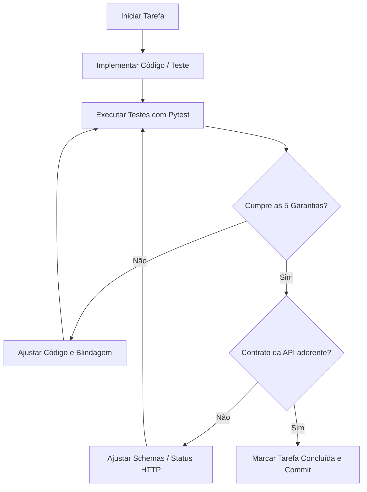

# Plano de Execução e Tarefas (TASKS)
## Assistente Virtual do Residencial Aurora ("Regra é Regra")

Este documento detalha o conjunto completo de tarefas necessárias para a implementação do projeto, estruturado com base nas especificações de [`docs/SPEC.md`](./SPEC.md), nos requisitos de produto de [`docs/PRD.md`](./PRD.md) e no enunciado oficial de [`README.md`](../README.md).

---

### Matriz de Rastreabilidade e Aderência

Cada fase e tarefa está estritamente mapeada para os critérios de aceite e os **15 passos do fluxo do avaliador**:

| Garantia / Requisito | Passos do Avaliador | Tarefas Responsáveis | Validação Obrigatória |
| :--- | :--- | :--- | :--- |
| **Garantia 1: Cobrança ou acesso só com confirmação** | Passos 6, 7, 8, 9, 11 | FASE 3 (T3.1 - T3.4), FASE 5 (T5.3) | Apenas taxa > 0 ou visitante geram pendência; reenvio ou ID inválido gera `409`; cancelamento e taxa zero executam direto. |
| **Garantia 2: Cada sessão pertence a um apartamento** | Passos 3, 4, 5, 10, 15 | FASE 2 (T2.2), FASE 4 (T4.2, T4.4) | Apartamento injetado exclusivamente via `session.state`; queries filtram por apartamento; zero vazamento de dados de outros moradores. |
| **Garantia 3: Nada se perde no reinício** | Passo 13 | FASE 2 (T2.1), FASE 4 (T4.1), FASE 5 (T5.4) | Sessões, eventos e dados persistidos em SQLite em disco; após reinício (`Ctrl+C`), histórico e dados persistem íntegros. |
| **Garantia 4: Regulamento consultado, não carregado** | Passos 12, 15 | FASE 4 (T4.3, T4.6, T4.7) | Agente principal sem regulamento nas instruções; ferramenta faz busca pontual por seção; eventos contêm apenas o trecho consultado. |
| **Garantia 5: Dois moradores, uma reserva (Atomicidade)** | Passos 14, 15 | FASE 2 (T2.1, T2.3), FASE 3 (T3.2) | Constraint `UNIQUE(area, data) WHERE status = 'ATIVA'`; transação imediata; colisão simultânea retorna HTTP 200 amigável sem erro 500. |
| **Contrato da API & Endpoints** | Passos 1 a 14 | FASE 5 (T5.1 - T5.6) | Endpoints `/sessoes`, `/confirmacoes`, `/eventos`, `/apartamentos/...` cumprem estritamente os schemas e códigos HTTP. |
| **Operação & Restauração** | Passos 1, 15 | FASE 1 (T1.1 - T1.4), FASE 2 (T2.4) | `uv sync` sem erros com ADK fixado; script de restauração volta ao estado dos arquivos originais em `dados/`. |

---

### Fases de Implementação e Checklist de Tarefas

#### Fase 1: Setup do Ambiente e Infraestrutura Base
- [ ] **T1.1**: Inicializar projeto Python 3.12 estruturado com `uv` (`pyproject.toml` e `uv.lock`).
- [ ] **T1.2**: Fixar a versão exata do `google-adk` na série 2 (`google-adk==2.2.0` ou versão estável superior), juntamente com `fastapi`, `uvicorn`, `pydantic-settings`, `aiosqlite`, `pytest`, `httpx`.
- [ ] **T1.3**: Criar `.env.example` contendo `GEMINI_API_KEY` e configurações necessárias, garantindo que `.env` esteja estritamente ignorado no `.gitignore`.
- [ ] **T1.4**: Configurar estrutura modular de diretórios (`app/api`, `app/domain`, `app/agents`, `app/scripts`, `tests`).

> **Critério de Validação Fase 1**: Executar `uv sync` em ambiente limpo sem warnings ou conflitos de resolução de dependências.

---

#### Fase 2: Persistência Durável, Concorrência e Domínio (Garantias 3 e 5)
- [ ] **T2.1**: Implementar `app/database.py` com suporte a SQLite durável em disco (`aurora.db`), habilitando `PRAGMA journal_mode=WAL`, chaves estrangeiras e o índice exclusivo:
  ```sql
  CREATE UNIQUE INDEX IF NOT EXISTS uq_reservas_area_data_ativa 
  ON reservas(area, data) WHERE status = 'ATIVA';
  ```
- [ ] **T2.2**: Implementar `app/domain/services.py` com métodos determinísticos:
  * `listar_reservas_apartamento(apartamento: str)`
  * `listar_visitantes_apartamento(apartamento: str)`
  * `consultar_disponibilidade_area(area: str, data: str)` (retorna apenas booleano, sem dados de terceiros)
  * `cancelar_reserva_propria(apartamento: str, codigo_ou_data: str)` (impede cancelamento de outros apartamentos)
  * Gerador de código de reserva único e não reutilizável (ex.: `RSV-XXXX`).
- [ ] **T2.3**: Implementar mecanismo de concorrência atômica da **Garantia 5**:
  * Gravação de reserva envelopada em transação atômica (`BEGIN IMMEDIATE`).
  * Tratamento de exceção de colisão (`sqlite3.IntegrityError`), retornando status amigável de recusa sem crash do servidor (HTTP 200).
- [ ] **T2.4**: Criar script de restauração `app/scripts/restore_data.py`:
  * Carrega os dados originais e imutáveis de `dados/apartamentos.json`, `dados/areas.json`, `dados/reservas.json` e `dados/visitantes.json`.
  * Restaura o banco de dados exatamente para o estado inicial da avaliação.

> **Critério de Validação Fase 2**: Testar restauração e testar inserção simultânea simulada em SQLite garantindo que duplicatas na mesma data disparem tratamento gracioso.

---

#### Fase 3: Máquina de Estados e Confirmações (Garantia 1)
- [ ] **T3.1**: Criar modelo e tabela de confirmações pendentes (`confirmacoes`) rastreando `id`, `session_id`, `apartamento`, `acao`, `detalhes_json`, `status` (`PENDENTE`, `APROVADA`, `NEGADA`).
- [ ] **T3.2**: Implementar regra de negócio determinística de necessidade de confirmação:
  * Reserva de área com `taxa > 0`: gera confirmação pendente obrigatória.
  * Reserva de área com `taxa == 0` (ex.: quadra): grava imediatamente sem confirmação.
  * Autorização de visitante: gera confirmação pendente obrigatória de liberação de portaria.
  * Cancelamento de reserva: sem confirmação.
- [ ] **T3.3**: Implementar idempotência e blindagem da rota de confirmações:
  * Chamada com `id` inexistente ou não pertencente à sessão $\rightarrow$ HTTP `409 Conflict`.
  * Chamada com `id` já respondido (`APROVADA` ou `NEGADA`) $\rightarrow$ HTTP `409 Conflict`.
  * Mensagens no chat dizendo *"Já confirmo aqui"* não aprovam a ação (permanece `PENDENTE`).

> **Critério de Validação Fase 3**: Validar que ações que geram custo ou acesso nunca tocam as tabelas `reservas` ou `visitantes` antes do `POST /confirmacoes` com `confirmado: true`.

---

#### Fase 4: Arquitetura Multi-Agente com Google ADK (Garantias 2 e 4)
- [ ] **T4.1**: Configurar `SessionService` baseado em SQLite no Google ADK (`app/agents/runtime.py`) para persistir o histórico de eventos e o `session.state`.
- [ ] **T4.2**: Implementar as ferramentas (*tools*) do ADK com validação estrita de identidade (**Garantia 2**):
  * As ferramentas obtêm o `apartamento` exclusivamente do `context.state["apartamento"]`.
  * Nenhuma ferramenta aceita parâmetro de apartamento enviado pelo LLM ou morador.
- [ ] **T4.3**: Implementar ferramenta de consulta pontual do regulamento (`app/agents/tools/regulamento_tools.py`):
  * Indexar/dividir `dados/regulamento.md` por tópicos (piscina, salão, barulho, mudanças, etc.).
  * Retornar apenas a seção consultada para evitar poluir o histórico de eventos da sessão (**Garantia 4**).
- [ ] **T4.4**: Construir Especialista em Reservas (`reservas_specialist`) com as tools de consulta neutra, solicitação e cancelamento próprio.
- [ ] **T4.5**: Construir Especialista em Portaria e Visitantes (`visitantes_specialist`) com tool de autorização pendente e consulta de autorizações da unidade.
- [ ] **T4.6**: Construir Especialista em Regulamento (`regulamento_specialist`) acoplado à tool de consulta pontual.
- [ ] **T4.7**: Construir Agente Principal / Orquestrador (`aurora_orchestrator`):
  * Responsável por entender a intenção do morador e transferir o controle para os especialistas.
  * **Restrição Obrigatória**: Não incluir o regulamento em seu system prompt.
- [ ] **T4.8**: Configurar o `App` e o fluxo de retomada (`resume`) do ADK no `Runner` para processamento correto das respostas de confirmação.

> **Critério de Validação Fase 4**: Inspeção dos eventos da sessão para garantir que o texto completo do regulamento nunca conste nos eventos, e que dados de terceiros não sejam acessíveis.

---

#### Fase 5: API REST FastAPI (Contrato Oficial)
- [ ] **T5.1**: Definir modelos Pydantic rigorosos para requisições e respostas em `app/api/schemas.py`.
- [ ] **T5.2**: Implementar rota `POST /sessoes`:
  * Cria a sessão no ADK, grava o apartamento em `state["apartamento"]` e retorna `201 {"session_id": "..."}`.
- [ ] **T5.3**: Implementar rota `POST /sessoes/{session_id}/mensagens`:
  * Executa o turno conversacional através do `Runner.run_async(...)`.
  * Retorna `200` com `resposta` e lista `confirmacoes_pendentes`. Retorna `404` se a sessão não existir.
- [ ] **T5.4**: Implementar rota `POST /sessoes/{session_id}/confirmacoes`:
  * Localiza a confirmação pendente; valida idempotência (`409` se inválido ou já respondido).
  * Se aprovado, executa a ação correspondente e retoma o agente via `Runner`.
- [ ] **T5.5**: Implementar rota `GET /sessoes/{session_id}/eventos`:
  * Extrai a lista cronológica integral dos eventos serializados do SessionService. Retorna `404` se sessão inexistente.
- [ ] **T5.6**: Implementar rotas de verificação para auditoria:
  * `GET /apartamentos/{numero}/reservas`
  * `GET /apartamentos/{numero}/visitantes`

> **Critério de Validação Fase 5**: Validação completa de contratos com chamadas HTTP simulando os formatos exatos de entrada e saída.

---

#### Fase 6: Bateria de Testes dos 15 Passos do Avaliador
- [ ] **T6.1**: Configurar `pytest` e `httpx.AsyncClient` em `tests/conftest.py`.
- [ ] **T6.2**: Testar **Passo 1**: Restauração dos dados iniciais e conferência das rotas de verificação (`101` com `RSV-1377` e `302` com Marina Duarte).
- [ ] **T6.3**: Testar **Passos 2 a 5**: Criação de S1 (101); tentativa de espionagem do 302 sem vazamento de `RSV-4821` nem Marina Duarte; tentativa de cancelamento da reserva do 302 frustrada; cancelamento da própria reserva da quadra com sucesso sem confirmação.
- [ ] **T6.4**: Testar **Passos 6 a 9**: Reserva da quadra sem confirmação pendente; reserva de salão com taxa gerando confirmação; rejeição sem gravação; aprovação com gravação única; reenvio retornando `409`; confirmação de ID inexistente retornando `409`; sessão inexistente em eventos retornando `404`.
- [ ] **T6.5**: Testar **Passos 10 a 12**: Sessão S2 tentando reservar data ocupada pelo 302 sem vazar código nem número 302; autorização de visitante com tentativa de bypass no texto gerando confirmação obrigatória e gravação pós-aprovação; pergunta sobre piscina aos domingos com horário correto sem capítulos extras nos eventos.
- [ ] **T6.6**: Testar **Passo 13**: Simulação de reinício do servidor (novo app/runner sobre o mesmo banco SQLite); conferência da contagem de eventos de S1; envio de nova mensagem após reinício; validação de unicidade de códigos de reserva.
- [ ] **T6.7**: Testar **Passo 14**: Disputa concorrente simultânea de reservas entre 101 e 201 no salão de festas na mesma data; ambas requisições respondem `200`; soma total de reservas ativas igual a exatamente 1.
- [ ] **T6.8**: Testar **Passo 15**: Verificação estática e estrutural de todos os critérios de aceite do repositório.

> **Critério de Validação Fase 6**: Todos os testes passando com 100% de sucesso via `uv run pytest`.

---

#### Fase 7: Documentação de Entrega e Finalização
- [ ] **T7.1**: Substituir o conteúdo de `README.md` pelo formato final exigido:
  * **Arquitetura**: Descrição de cada agente, responsabilidade, como é acionado e por quê.
  * **Garantias**: Apontamento explícito do arquivo e trecho de código para cada uma das 5 garantias.
  * **Como rodar**: Pré-requisitos, variáveis de `.env`, comando de subida e comando de restauração.
- [ ] **T7.2**: Garantir integridade dos arquivos originais em `dados/`.
- [ ] **T7.3**: Git commit e push final para a branch `main` do fork público.

---

### Procedimento de Validação Contínua

Enquanto as tarefas forem executadas, o seguinte loop de validação será aplicado a cada incremento:


